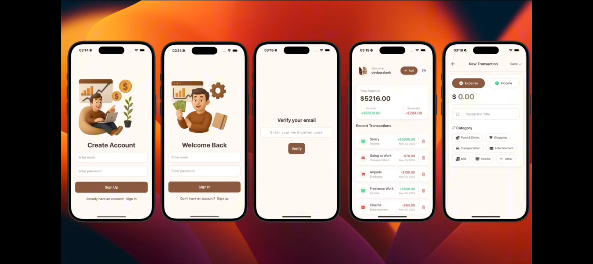

📱 BudgetApp — Smart Budget Management App with React Native Expo and Clerk

BudgetWise is a modern, intuitive, and secure budget-tracking mobile application designed to help users take full control of their financial life. Built with React Native (Expo) and powered by a robust Node.js + Express backend, the app allows users to seamlessly manage income, expenses, and daily transactions while enjoying a clean and friendly interface.

The application provides a smooth and visually appealing experience—allowing users to create an account, sign in, verify their email, add transactions, view recent activity, and track their financial health in real time.

🚀 Core Features
🔐 Secure Authentication

Authentication powered by Clerk for safe login, registration, and session handling.

Email verification ensures an additional security layer before accessing the dashboard.

💰 Income & Expense Tracking

Add transactions by selecting:

Expense

Income

Choose from categories such as Food & Drinks, Shopping, Transportation, Entertainment, Bills, and more.

📊 Real-Time Dashboard

View your current balance, total income, and total expenses instantly.

Beautiful transaction list showing:

Amounts

Categories

Type (Income/Expense)

Date and description

🗂️ Recent Transactions

Automatic sorting of all recent activities.

Icons and colors help differentiate between transaction types.

🧭 Clean & User-Friendly UI

Warm color palette with financial-themed illustrations.

Simple, modern design with clear typography for easy readability.

🛠️ Tech Stack
📌 Backend

Built with a lightweight but powerful setup:

Node.js

Express.js

Mongoose (MongoDB ORM)

MongoDB (database)

dotenv for environment configuration

CORS for secure cross-origin communication

The backend handles:

User data

Transaction storage

CRUD operations for income/expense records

Authentication session validation (via Clerk API)

📱 Mobile App

Designed using:

React Native with Expo

Clerk Authentication

Context API for managing state and API actions

Fetch-based API integration connected to the backend

Responsive UI optimized for both iOS and Android

🎯 Purpose of the App

BudgetWise helps users:

Track and organize their financial activities

Understand spending habits

Improve financial discipline

Easily manage income and expenses daily

Whether it’s managing salary, transportation costs, shopping, entertainment, or bills, BudgetWise provides a simple yet powerful solution to keep your finances healthy.
